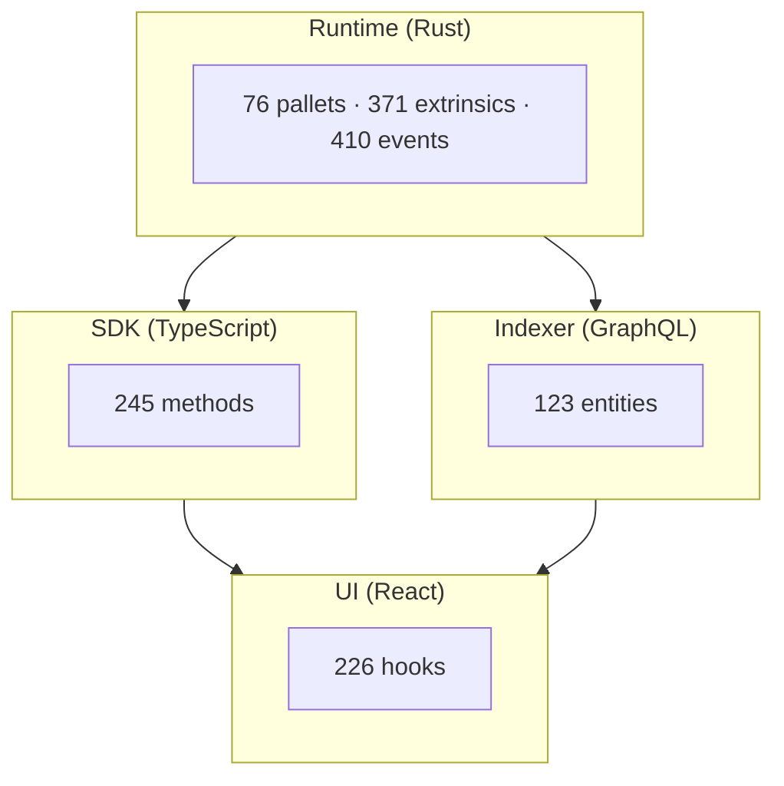

# AI & Agents

The Hydration Codex provides two types of resources for AI assistants:

1. **Context Files (Markdown)** - Human-readable overviews for loading into AI context windows
2. **Data Files (JSON)** - Structured data for programmatic queries and tool use

## For Humans Guiding AI

When working with an AI assistant (Claude, GPT, etc.) on Hydration code, load these context files:

```
# Start with the stack overview
Load: agents/contexts/OMNISCIENCE.md (~8K tokens)

# Add layer-specific context as needed
Load: agents/contexts/L1-runtime.md   # For pallet work (~3K tokens)
Load: agents/contexts/L2-sdk.md       # For SDK work (~1K tokens)
Load: agents/contexts/L3-indexer.md   # For indexer work (~17K tokens)
Load: agents/contexts/L4-ui.md        # For UI work (~23K tokens)
```

## For AI Agents (Programmatic)

AI agents and tools should use the structured JSON files:

```typescript
// Load the manifest to discover available files
const manifest = await fetch('/ai/ai-manifest.json').then(r => r.json());

// Load layer indexes (~3K tokens each)
const runtime = await fetch('/ai/runtime-index.json').then(r => r.json());
const hooks = await fetch('/ai/ui-index.json').then(r => r.json());

// Find cross-layer connections
const xref = await fetch('/ai/xref-ui-runtime.json').then(r => r.json());
```

See [AI Data Files](/ai/context/data-files) for complete documentation.

## Token Budgets

| Resource | Tokens | Best For |
|----------|--------|----------|
| **Markdown Context** | | |
| OMNISCIENCE.md | ~8K | Stack overview, cross-refs |
| L1-runtime.md | ~3K | Pallet summaries |
| L2-sdk.md | ~1K | SDK package overview |
| L3-indexer.md | ~17K | Entity details |
| L4-ui.md | ~23K | Hook details |
| **JSON Data** | | |
| ai-manifest.json | ~500 | File discovery |
| runtime-index.json | ~3K | Pallet listing |
| ui-index.json | ~2K | Hook listing by category |
| xref-ui-runtime.json | ~3K | UI→Runtime mapping |
| xref-edges.json | ~10K | All relationships |

## Stack Overview



## Common Workflows

### "How do I add liquidity?"

**For humans:** Load OMNISCIENCE.md, search for "liquidity"

**For agents:**
```typescript
const xref = await fetch('/ai/xref-ui-runtime.json').then(r => r.json());
const liquidityHooks = xref.connections.filter(c => c.category === 'liquidity');
// Returns hooks with their pallet calls
```

### "What events does the indexer track?"

**For humans:** Load L3-indexer.md

**For agents:**
```typescript
const edges = await fetch('/ai/xref-edges.json').then(r => r.json());
const handlers = edges.byType.handles;
// Returns all indexer → runtime event mappings
```

### "Trace a feature through the stack"

1. Find the UI hook in `ui-index.json`
2. Look up its runtime calls in `xref-ui-runtime.json`
3. Check if those events are indexed in `xref-edges.json`
