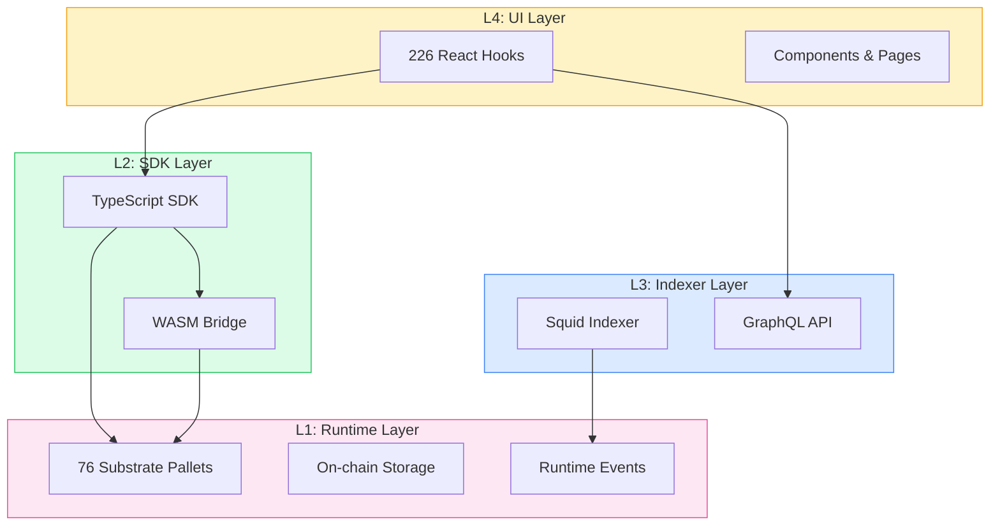
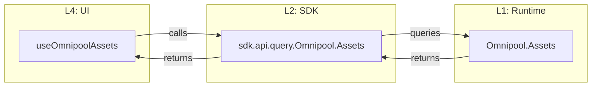

# Hydration Codex

Auto-generated, cross-referenced documentation for the entire Hydration Protocol stack.

## Architecture Overview

## Quick Navigation

| Section | Description |
|---------|-------------|
| [Reference](/reference) | Pallets, SDK, Indexer entities, UI hooks |
| [AI & Agents](/ai) | Context files for AI assistants |

## Data Flow Example

When you call `useOmnipoolAssets()` in the UI:

## Getting Started

1. **Browse Reference** - Use [Reference](/reference) to explore pallets, hooks, SDK methods, and indexer entities
2. **For AI Assistants** - Load [AI Context](/ai) for structured data files

## About This Documentation

This documentation is **auto-generated** from source code across 4 repositories:

- `hydradx-ui` - React frontend (L4)
- `hydration-data-indexer` - Squid indexer (L3)
- `sdk` - TypeScript SDK (L2)
- `hydration-node` - Substrate runtime (L1)

Pages are regenerated when source code changes, ensuring documentation stays in sync.
