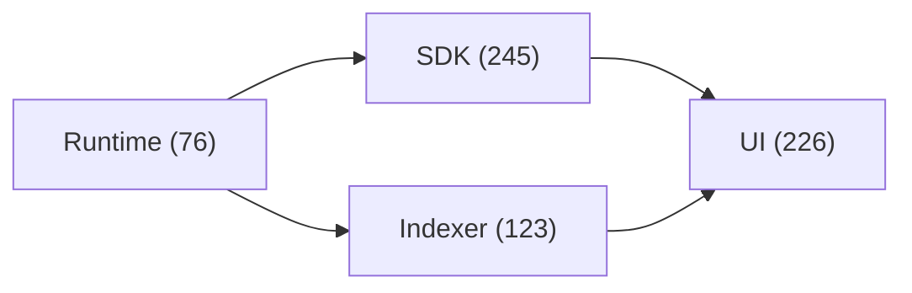

# Reference

Complete reference documentation for the Hydration Protocol stack.

## Stack

| Layer | Count | Description |
|-------|-------|-------------|
| [Runtime](/category/runtime) | 76 pallets | Substrate runtime (Rust) |
| [SDK](/reference/sdk/sdk) | 245 methods | TypeScript SDK |
| [Indexer](/category/indexer) | 123 entities | GraphQL historical data |
| [UI](/category/ui) | 226 hooks | React frontend |

## Quick Find

Use search to find any entity:
- `Omnipool` → Runtime pallet
- `OmnipoolAsset` → Indexer entity
- `useSwap` → UI hook
