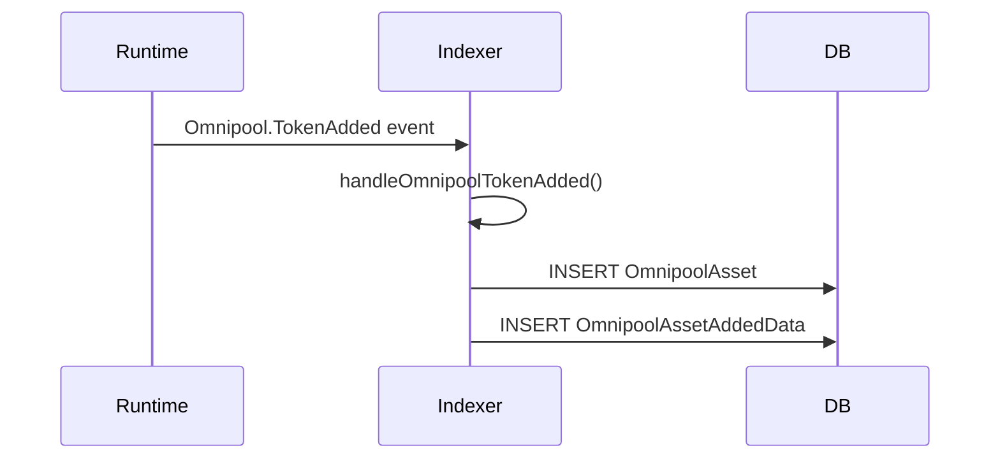

# Proposal: Enhanced Indexer Documentation

**Date:** 2025-12-27
**Status:** Proposed
**Author:** Architecture Review

## Problem

Current indexer documentation is **entity-centric**:
```
docs-site/docs/reference/indexer/
├── OmnipoolAsset.mdx      # Shows fields, but not how it gets populated
├── Swap.mdx               # Shows fields, but not which events create it
└── ...
```

But developers need to understand the **data flow**:
```
Runtime Event → Handler Function → Entity Population
```

### Current Gaps

1. **No runtime event mapping** - Entity pages don't show which runtime events create/update them
2. **Handler extraction incomplete** - `createsEntities` is always empty
3. **Internal event names** - Extraction shows `OmnipoolAssetVolumeUpdates` instead of `Omnipool.TokenAdded`

## Proposed Solution

### 1. Enhanced Extraction

Update `src/extract/indexer.ts` to capture:

```typescript
interface EnhancedHandler {
  handler: string;           // Function name
  file: string;              // Source file
  line: number;              // Line number
  runtimeEvents: string[];   // ["Omnipool.TokenAdded", "Omnipool.BuyExecuted"]
  createsEntities: string[]; // ["OmnipoolAsset", "Swap"]
  updatesEntities: string[]; // ["OmnipoolAssetHistoricalData"]
}

interface IndexerExtraction {
  // Existing
  schema: { entities: Entity[] };
  handlers: Handler[];

  // NEW
  runtimeEventMap: Record<string, string[]>;  // runtime event → handlers
  entitySourceMap: Record<string, string[]>;  // entity → handlers that populate it
}
```

### 2. Parse appConfig.ts for Runtime Events

The source of truth is `indexers/liquidity-pools/src/appConfig.ts`:

```typescript
const eventsToListen = [
  events.assetRegistry.locationSet.name,    // → AssetRegistry.LocationSet
  events.omnipool.tokenAdded.name,          // → Omnipool.TokenAdded
  events.omnipool.buyExecuted.name,         // → Omnipool.BuyExecuted
  // ...
];
```

Extract these and map to canonical IDs:
```
runtime:pallet:AssetRegistry:event:LocationSet → indexer:handler:handleAssetRegistry
```

### 3. New Documentation Structure

#### Option A: Handler Pages (Recommended)

Create new handler documentation:
```
docs-site/docs/reference/indexer/
├── entities/               # Current entity pages (enhanced)
│   └── OmnipoolAsset.mdx
├── handlers/               # NEW: Handler pages
│   ├── index.mdx          # Handler overview
│   ├── omnipool/
│   │   ├── handleOmnipoolTokenAdded.mdx
│   │   └── handleOmnipoolBuyExecuted.mdx
│   └── xyk/
│       └── handleXykPoolCreated.mdx
└── events/                 # NEW: By runtime event
    └── index.mdx          # Which events are indexed
```

#### Handler Page Template

```mdx
---
title: handleOmnipoolTokenAdded
sidebar_label: handleOmnipoolTokenAdded
---

# handleOmnipoolTokenAdded

Processes token additions to the Omnipool.

## Runtime Events

| Event | Pallet | Description |
|-------|--------|-------------|
| [TokenAdded](../../pallets/Omnipool#tokenadded) | Omnipool | Emitted when a new token is added |

## Entities Created/Updated

| Entity | Operation | Description |
|--------|-----------|-------------|
| [OmnipoolAsset](../entities/OmnipoolAsset) | Create | New asset record |
| [OmnipoolAssetAddedData](../entities/OmnipoolAssetAddedData) | Create | Addition event data |

## Source

**File:** `indexers/liquidity-pools/src/handlers/omnipool/tokenAdded.ts`
**Line:** 15

```typescript
// Code snippet
```

## Related Handlers

- [handleOmnipoolBuyExecuted](./handleOmnipoolBuyExecuted) - Processes trades
- [handleOmnipoolLiquidityAdded](./handleOmnipoolLiquidityAdded) - Processes LP additions
```

#### Option B: Enhanced Entity Pages

Add "Source Handlers" section to existing entity pages:

```mdx
# OmnipoolAsset

## Fields
...

## Source Handlers

This entity is populated by:

| Handler | Runtime Event | Operation |
|---------|---------------|-----------|
| [handleOmnipoolTokenAdded](../handlers/omnipool/handleOmnipoolTokenAdded) | Omnipool.TokenAdded | Create |
| [handleOmnipoolLiquidityAdded](../handlers/omnipool/handleOmnipoolLiquidityAdded) | Omnipool.LiquidityAdded | Update |

## GraphQL Examples
...
```

### 4. Implementation Steps

1. **Update `src/extract/indexer.ts`**
   - Parse `appConfig.ts` to get `eventsToListen`
   - Convert `events.omnipool.tokenAdded.name` → `Omnipool.TokenAdded`
   - Map handlers to runtime events via file/function analysis

2. **Create `src/synthesize/handlers.ts`**
   - Generate handler MDX pages
   - Build runtime event → handler index
   - Build entity → handler reverse index

3. **Update `src/synthesize/indexer.ts`**
   - Add "Source Handlers" section to entity pages
   - Add links to handler pages

4. **Update sidebars.ts**
   - Add handlers section under Indexer

### 5. Data Flow Visualization

Add Mermaid diagram to handler pages:



## Benefits

1. **Developers can trace data flow** - From runtime event to entity
2. **Easier debugging** - Know which handler to check for data issues
3. **Better onboarding** - Understand indexer architecture quickly
4. **AI agents** - Structured context for code generation

## Effort Estimate

- Extraction enhancement: ~200 lines
- Handler synthesizer: ~400 lines
- Entity page updates: ~100 lines
- Total: ~700 lines of code

## Decision

- [ ] Approve Option A (Handler pages)
- [ ] Approve Option B (Enhanced entity pages only)
- [ ] Approve both A and B
- [ ] Request changes
